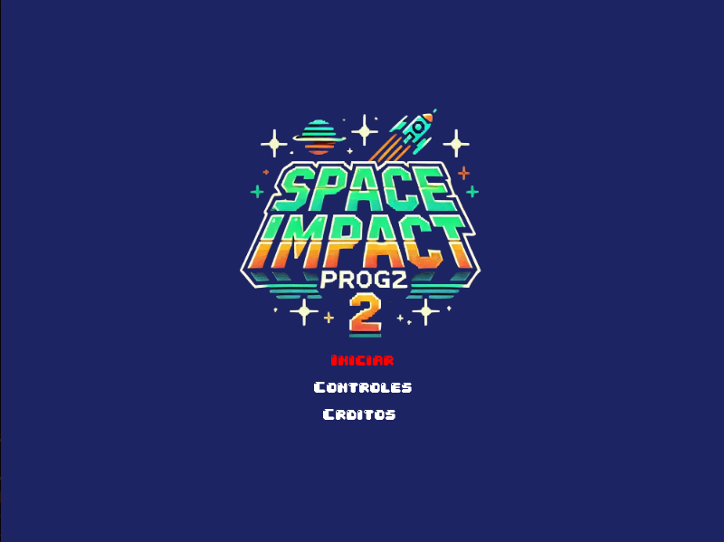
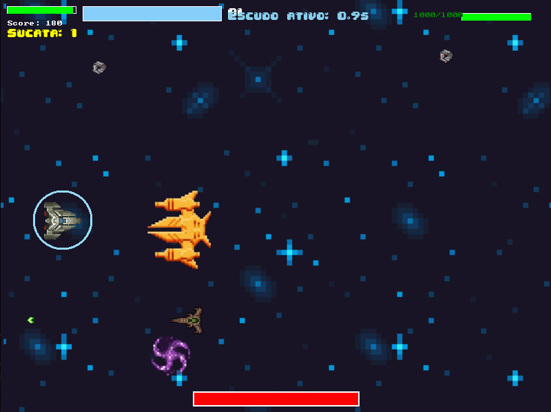
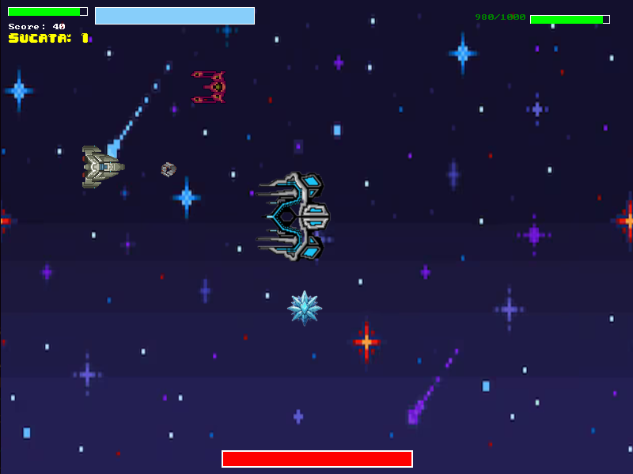

# 🚀 Space Impact Clone

**Space Impact Clone** é um jogo inspirado no clássico **Space Impact**, desenvolvido como parte de um trabalho da disciplina de **Programação 2**. Este projeto utiliza a biblioteca **Allegro5** e foi uma grande oportunidade para aprofundar conhecimentos em programação de jogos e eventos.

## 🎮 Funcionalidades Principais
- **Duas Fases Exclusivas**:
  - Cenários distintos para cada fase.
  - Chefões únicos com ataques desafiadores e mecânicas variadas.
- **Jogabilidade Dinâmica**:
  - Nave controlada pelo jogador com HP, escudo e armas especiais.
  - Inimigos com diferentes padrões de movimentação e ataques.
- **Ataques Especiais**:
  - Dois tipos de ataques especiais adquiridos no mapa.
  - Limitação de tempo para uso, aumentando a estratégia no combate.

## 📸 Fotos do Jogo 

- Tela Inicial:
  

- Primeira Fase com boss:
  

- Segunda Fase com boss:
  

## 🕹️ Controles

### Jogador
- **Teclas de Movimento**:  
  - **WASD**: Movimentação da nave.  
  - **C**: Dispara o ataque principal.  
  - **E**: Ativa o escudo (se disponível).  
  - **L**: Ativa o laser (se disponível).

### Menus
- **Navegação**: Use as setas para navegar.
- **Seleção**: Pressione **Enter** para confirmar.
- **Voltar**: Pressione **Enter** para retornar.

> **Dica**: Combine escudo e ataques especiais para lidar com os chefes.

## 🚀 Como Jogar

### Pré-requisitos
- **Allegro5**: Biblioteca necessária para gráficos, sons e eventos.
- **Compilador GCC**: Para compilar o código.
- **Make**: Para facilitar o processo de compilação.

### Instruções para Baixar e Executar

1. Clone este repositório:
   ```bash
   git clone git@github.com:ricardobacano/space_impact_303.git
   ```
2. Acesse o diretório do projeto:
   ```bash
   cd space_impact_303/
   ```
3. Compile o jogo usando o Makefile:
   ```bash
   make
   ```
4. Execute o jogo:
   ```bash
   ./space_impact
   ```

## 🛠️ Tecnologias Utilizadas

- **Linguagem**: C
- **Biblioteca Gráfica**: Allegro5
- **Ferramentas**: GCC, Makefile

## 📚 O que Eu Aprendi

- **Programação orientada a eventos**: Implementação de eventos e estados no jogo.
- **Gerenciamento de memória**: Uso eficiente de ponteiros e estruturas de dados.
- **Estruturas de dados**: Lista ligada para organizar projéteis, inimigos e outros elementos do jogo.
- **Biblioteca Allegro5**: Manipulação de gráficos, sons e eventos.

## 🎯 Requisitos Implementados
- **Fases e Chefes**:
  - Duas fases com cenários exclusivos.
  - Dois chefes desafiadores com mecânicas únicas.
- **Inimigos**:
  - Quatro tipos diferentes de inimigos, incluindo dois que lançam projéteis.
  - Movimentação dinâmica de inimigos.
- **Jogabilidade**:
  - Ataques especiais adquiridos durante as fases.
  - Sistema de vida e escudo.
  - Aprimoramento de habilidades apartir da coleta de sucata.

---
